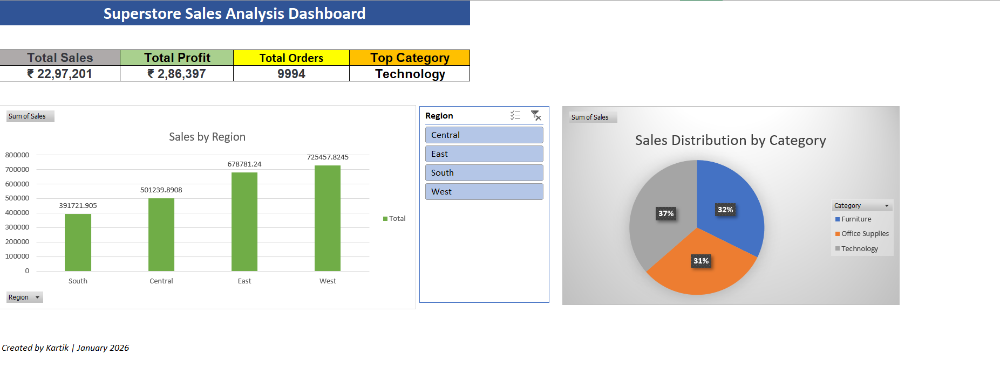

# 📊 Superstore Sales Dashboard

---

## 📋 Project Overview

This is my **first Excel project** as part of my Data Analytics journey. I analyzed **₹22.97 lakh** in sales data from a Superstore dataset to identify key business insights.

---

## 🎯 Objective

Build an interactive Excel dashboard to analyze:
- Sales performance across regions
- Product category profitability
- Top-performing products
- Order distribution by state

---

## 🛠️ Tools & Skills Used

**Tool:** Microsoft Excel

**Skills Applied:**
- ✅ Pivot Tables (data summarization)
- ✅ VLOOKUP (data matching)
- ✅ Charts (Column, Pie)
- ✅ Slicers (interactive filtering)
- ✅ Dashboard design & layout
- ✅ Data analysis & visualization

---

## 📊 Key Insights

### 💰 Overall Performance:
- **Total Sales:** ₹22,97,201
- **Total Profit:** ₹2,86,397
- **Profit Margin:** ~12.5%

### 🏆 Best Performing Region:
- **West** region leads with **₹7.25 lakh** in sales (31.6%)

### 📦 Category Analysis:
- **Technology** is the most profitable category
  - Sales: ₹8.36 lakh
  - Profit: ₹1.45 lakh (highest profit margin)
- **Furniture** has high sales but low profitability
  - Sales: ₹7.42 lakh
  - Profit: Only ₹18,451 (needs attention!)

### ⭐ Top Products:
1. Canon imageCLASS 2200 Advanced Copier - ₹61,600
2. Cisco TelePresence System - ₹22,638
3. Fellowes Binding Machine - ₹27,453

---

## 📈 Dashboard Features

✅ **4 KPI Cards** showing key metrics at a glance  
✅ **Interactive Region Slicer** - filter all charts by clicking region  
✅ **Column Chart** - Sales comparison by region  
✅ **Pie Chart** - Category sales distribution  
✅ **Professional formatting** with clean layout  

---

## 📂 Files in This Project

| File | Description |
|------|-------------|
| `Superstore_Sales_Dashboard.xlsx` | Complete Excel workbook with data, Pivot Tables, and Dashboard |
| `Dashboard_Screenshot.png` | Preview image of the final dashboard |
| `README.md` | This file - project documentation |

---

## 💡 What I Learned

This project helped me master:
- Building Pivot Tables from raw data
- Creating dynamic charts that update with slicers
- Designing a professional dashboard layout
- Extracting business insights from data
- Presenting data visually for decision-making

---

## 🚀 Next Steps

- Build a second Excel dashboard with different dataset
- Learn advanced formulas (INDEX-MATCH, SUMIFS)
- Move to SQL for database querying

---

## 📫 Connect With Me

- **GitHub:** [Your GitHub Profile Link]
- **LinkedIn:** [Add in Week 2]
- **Email:** [Your Email]

---

**Project Completed:** January 2026  
**Status:** ✅ Complete  
**Time Spent:** ~3 hours (Day 3 of Data Analytics Journey)
